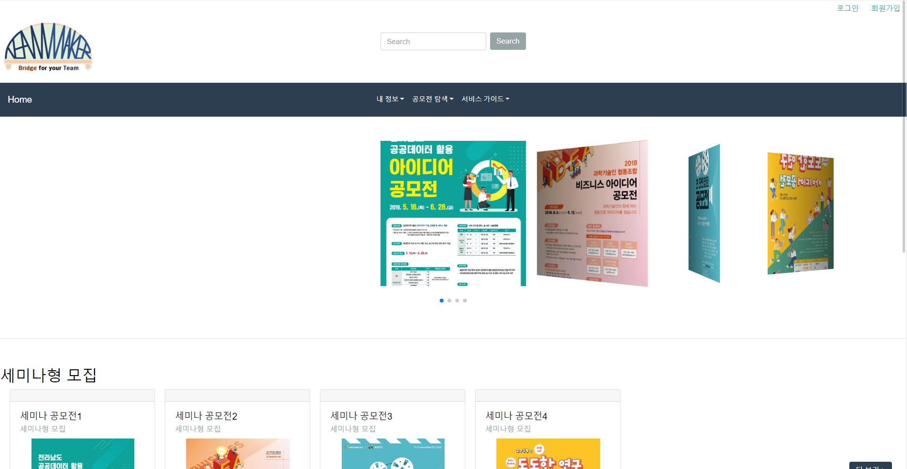

# teamMaker
SW비즈니스와 창업 수업 프로젝트 웹 서비스 구현

SW 비즈니스와 창업 수업 프로젝트의 일환으로 웹 서비스 TeamMaker의 데모를 구현하였다.
짧은 시간동안 구현한 결과물이기 때문에 기본 기능만을 가지고 있으나 추후에 발전시킬 예정

개발환경 : eclipse 2018.09, tomcat 8.5, maven 3.6, jdk 1.8, Oracle 11g Express

Spring framework 환경에서 MVC패턴으로 구현

log4j2 사용

spring tiles3 사용

이클립스나 스프링 STS를 통해 코드를 사용하고자 하는 경우 해당 프로젝트를 workspace에 넣어서 사용

Package Explorer로 보는 것을 추천, 이를 기반으로 설명한다.

src/main/java는 크게 5가지 기능으로 나뉨

1. cmm
 1) logger.LoggerInterceptor.java
 전처리, 후처리(prehandle, posthandle)을 사용하기 위한 인터셉터 파일.
 2) session.SessionManageUtil.java
세션과 관련된 기능을 모아놓은 java 파일.

<!-- -------------------------------------------------------------------------------------------------------- -->

 이 밑으로는 MVC 패턴에 따른 기능 구현으로 되어있으며 DAO, VO, Controller, Service, ServiceImpl을 가지고 있다.
 실질적인 기능은 간단하기 때문에 DB에서 mybatis로 실행되는 쿼리와 (XXX_SQL.xml 참고) 그 결과를 반환한다.

 DAO같은 경우는 전자정부프레임워크에서 지원하는 @Mapper 어노테이션을 사용하기 때문에 interface로 구현된다.

 VO는 DB 테이블대로 구성하였다. 따라서 살펴보면 DB 구조를 파악할 수 있을 것(테이블 3개밖에 없음) 

 Service와 ServiceImpl에서 기능을 담당하는데, 로그인같은 경우는 기존에 있던 계정인지 확인하는 과정이나 비밀번호를 확인하는 과정을
 한꺼번에 처리해서 Controller단에서 할 필요가 없다.
 (즉, Service에서는 없는 기능이지만 DAO에는 있는 기능이 있어 하나의 Service에 2개의 DAO 메소드를 사용(쿼리문 2개 사용)

2. login
로그인 및 회원가입과 관련된 부분

3. main
메인 화면에서 searchVO의 데이터를 사용하기 때문에 이부분에 주의할 것

4. myinfo
내 정보/커리어카드 관리 부분

5. search
공모전 목록을 띄워주는 구현부분

6. guide(미구현)
서비스 가이드와 개요를 소개하고 안내하는 부분

java/main/resource와 jsp 부분도 위와 같은 단위로 파일을 나누어 구현했기 때문에 보면 충분히 이해할 수 있을 것
